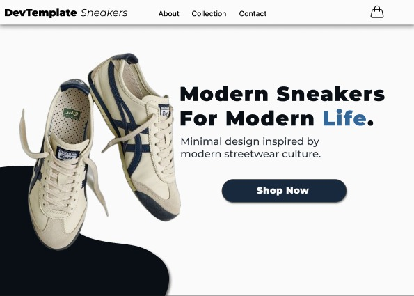
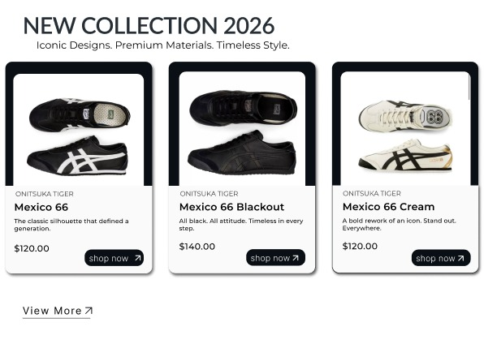
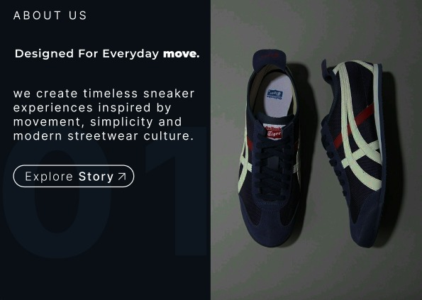
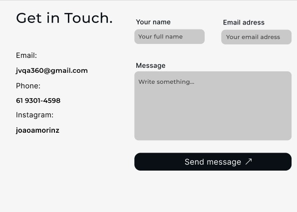

# Landing Template

🖥️Template de landing page em React com Vite.

## Estrutura

```txt
landing-template/
├── public/
├── src/
│   ├── assets/
│   │   └── images/
│   ├── components/
│   │   ├── Navbar.jsx
│   │   ├── Hero.jsx
│   │   ├── ProductCard.jsx
│   │   ├── Collection.jsx
│   │   └── Footer.jsx
│   ├── App.jsx
│   ├── main.jsx
│   └── index.css
├── .gitignore
├── package.json
├── README.md
└── vite.config.js
```

## Preview

### Hero Section



---

### Collection Section



---

### About Section



---

### Contact Section



## Scripts

```bash
npm run dev
npm run build
```
=======
# DevTemplate Sneakers Landing Page

Uma landing page moderna, minimalista e responsiva para uma loja fictícia de sneakers, criada com foco em design clean, composição visual forte e estrutura simples para devs iniciantes ou intermediários reutilizarem.

> Projeto criado como template visual para treinar UI Design, React, componentização e Tailwind CSS.

---

## Preview

---

## Sobre o projeto

O **DevTemplate Sneakers Landing Page** é um template de landing page inspirado em lojas modernas de calçados e streetwear.

A proposta do projeto é ser simples, bonito e **reutilizável**, servindo como base para:

- lojas de calçados;
- landing pages de produtos;
- páginas de coleção;
- estudos de React;
- estudos de UI Design;
- projetos de portfólio.

O layout foi pensado primeiro no **Figma**, priorizando espaçamento, hierarquia visual, cards de produto e uma hero section com estética premium.

---

## Tecnologias utilizadas

- React
- Vite
- Tailwind CSS
- Figma
- Git/GitHub

---

## Features

- Hero section moderna
- Navbar simples
- Cards de produtos
- Seção de nova coleção
- Layout clean e minimalista
- Design inspirado em streetwear/sneaker culture
- Estrutura pensada para componentização
- Fácil personalização
- Adição de itens ao carrinho

---

## Estrutura do projeto

```bash
src/
├── assets/
│   └── images/
│
├── components/
│   ├── About.jsx
|   ├── Cart.jsx
|   ├── Navbar.jsx
|   ├── Contact.jsx
│   ├── Hero.jsx
│   ├── ProductCard.jsx
│   ├── Collection.jsx
│   └── Footer.jsx
│
├── App.jsx
├── main.jsx
└── index.css
```

---

## Seções da landing page

### Navbar

Menu simples com links principais:

- Home
- About
- Collection
- Contact

---

### Hero Section

Seção principal com chamada de impacto:

**Modern Sneakers For Modern Life.**

Subtítulo:

**Minimal design inspired by modern streetwear culture.**

Botão de ação:

**Shop Now**

---

### New Collection

Seção com cards de produtos da coleção:

- Mexico 66
- Mexico 66 Blackout
- Mexico 66 Cream

Cada card contém:

- imagem do produto;
- nome da marca;
- nome do modelo;
- pequena descrição;
- preço;
- botão de compra.

---

## Textos usados no projeto

### Hero

**Title**

Modern Sneakers For Modern Life.

**Subtitle**

Minimal design inspired by modern streetwear culture.

**Button**

Shop Now

---

### Collection

**Section title**

NEW COLLECTION 2026

**Section subtitle**

Iconic Designs. Premium Materials. Timeless Style.

---

### Produto 1

**Brand**

ONITSUKA TIGER

**Name**

Mexico 66

**Description**

The classic silhouette that defined a generation.

**Price**

$120.00

---

### Produto 2

**Brand**

ONITSUKA TIGER

**Name**

Mexico 66 Blackout

**Description**

All black. All attitude. Timeless in every step.

**Price**

$140.00

---

### Produto 3

**Brand**

ONITSUKA TIGER

**Name**

Mexico 66 Cream

**Description**

A bold rework of an icon. Stand out. Everywhere.

**Price**

$120.00

---

## Como rodar o projeto

Clone o repositório:

```bash
git clone https://github.com/joaoamorinz0/Landing-Page-Template.git
```

Entre na pasta:

```bash
cd Landing-Page-Template
```

Instale as dependências:

```bash
npm install
```

Rode o projeto:

```bash
npm run dev
```

Abra no navegador:

```bash
http://localhost:5173
```

---

## Objetivo de aprendizado

Este projeto foi criado para praticar:

- criação de landing pages;
- organização visual no Figma;
- componentização no React;
- uso inicial de Tailwind CSS;
- construção de um layout reutilizável;
- publicação de projetos no GitHub;
- criação de portfólio para desenvolvedor front-end.

---

## Melhorias futuras

- Adicionar versão mobile
- Criar animações suaves
- Adicionar dark mode
- Criar página individual de produto
- Adicionar carrinho fictício
- Criar filtros de produtos
- Melhorar acessibilidade
- Publicar deploy na Vercel

---

## Inspiração visual

O projeto foi inspirado em layouts modernos de lojas de sneakers, streetwear e marcas fashion minimalistas.

A ideia não é copiar uma marca específica, mas estudar composição visual, hierarquia, espaçamento e estética premium.

---

## Status do projeto

🚧 Em desenvolvimento || Início do projeto || Em aprendizado!

---

## Autor

Feito por João Victor.

GitHub: [@joaoamorinz0](https://github.com/joaoamorinz0)

---

## Licença

Este projeto está sob a licença MIT.  
Sinta-se livre para usar, estudar, modificar e adaptar.
>>>>>>> 26028c28e634827d58a7ecb5faabbd53e73d32ec
